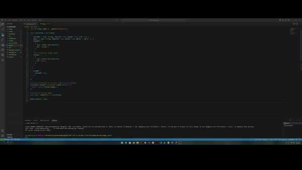

#  NoSQL: Social Network API

## Technologies

Node.js  
Express  
Mongoose (NoSQL)
MongoDB

## Description

This project showcases a functional backend API for a social media platform. It provides the underlying infrastructure to support the various features and functions of the social media application.
 The API handles user authentication, data storage, data retrieval, and other crucial tasks that are necessary for the smooth functioning of the platform. 
 The development of a robust and reliable backend API is essential for the success of a social media application as it directly impacts the user experience.

## Installation

1. Clone the Repository on to your machine.
2. Open the terminal and ensure you are in the right file path.
3. Run the command ```npm i``` to download the packages.
4. Then run the command ```npm run dev``` or ```npm run start``` to run the application.

## Mock Up and walkthrough link

The following animations show examples of the application's API routes being tested in Insomnia.

[](https://drive.google.com/file/d/12cumVcGRYDMFFvb18qg4EGSn_zIEbi-y/view?usp=share_link)